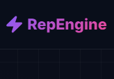
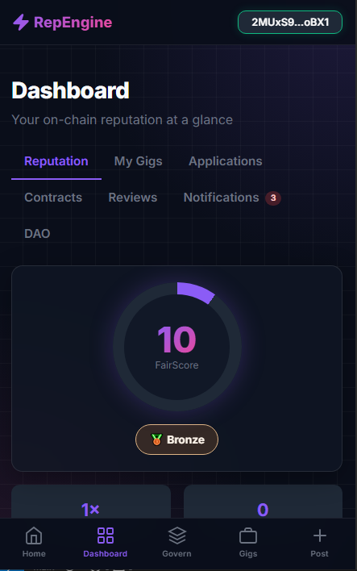

<div align="center">
  
  
  # ⚡ RepEngine
  ### Trustless Web3 Freelance Marketplace & Reputation-Weighted DAO

  [](https://p01--repengine--qw5xhkblp8hy.code.run/)
  [](https://opensource.org/licenses/MIT)
  [](https://dotnet.microsoft.com/download)
</div>

RepEngine is a production-ready, enterprise-grade gig marketplace and DAO governance platform. It directly addresses the Web3 freelancing "trust deficit"—anonymous scammers, unverified portfolios, and rug pulls—by deeply integrating the **FairScale API** to mathematically gate job market access and weight decentralized voting power based on cryptographic, on-chain reputation.

> **Live Production Demo:** [\> Access RepEngine Here <](https://p01--repengine--qw5xhkblp8hy.code.run/)
> 
> **Traction & Community Vote:** [\> RepEngine on Legends.fun FAIRathon <](https://www.legends.fun/products/9b106612-02fe-403a-90c0-63bb9e2c21da)
> 
> **Product Walkthrough Video:** [Insert YouTube/Loom Link Here]



---

## 🏗️ Core Architecture & FairScale Integration

RepEngine is engineered as a robust, full-stack application, prioritizing security, mobile UX, and highly relational data integrity over simple prototype constraints. FairScore is not a decorative element in RepEngine; it is the core constraint engine of the entire platform.

### 🛡️ 1. Cryptographically Gated Job Marketplace
The platform utilizes an escrow-backed contract system where only cryptographically verified, high-reputation (FairScore) actors can participate in high-value bounties.
* **Premium Gigs:** Clients can enforce specific minimum FairScore thresholds (e.g., a minimum reputation score of 80 is required for the 'Apply' button to even render or execute the transaction).
* **Dynamic Reputation Tiers:** The backend dynamically calculates and updates user ranks (`Unranked`, `Bronze`, `Silver`, `Gold`, `Diamond`, `Legend`) via real-time synchronous polling from the FairScale API infrastructure.
* **Reputation as Risk Management:** We use FairScale as a leading indicator of wallet safety, preventing known malicious actors from joining premium gig proposals.

### 🏛️ 2. Reputation-Weighted DAO Governance
Governance in RepEngine discards the flawed "1-wallet-equals-1-vote" model which is highly susceptible to Sybil attacks.
* **Proposal Constraints:** Creating new governance proposals dynamically requires a minimum predefined FairScore tier, mitigating spam and low-effort governance attacks.
* **Mathematical Voting Power:** Voting weight is strictly calculated and scaled by the voter's cryptographic FairScore at the exact moment the transaction is cast. A `Legend` tier voter holds mathematically more sway than a `Bronze` tier voter.

### 📱 3. Native Mobile UX & Cryptography (Deep Link API)
Instead of forcing users into clunky, sandboxed wallet in-app browsers, RepEngine achieves native-level mobile authentication and signing via advanced cryptography.
* **Phantom & Solflare Deep Linking:** Mobile wallet interaction is handled natively using the `phantom://` and `solflare://` deep link specification.
* **TweetNaCl Ephemeral Keypairs:** The application generates secure, ephemeral `NaCl` box encryption keypairs on the client. Payloads are encrypted and transmitted across the OS environment to the native wallet app, ensuring secure, cross-app signatures on iOS and Android without exposing private keys or relying on webviews.
* **Progressive Web App (PWA):** Fully installable mobile PWA utilizing Service Worker `stale-while-revalidate` caching strategies and optimized offline network handling.

### ⚙️ 4. Enterprise Backend Infrastructure
* **Stack:** Built on ASP.NET Core 10.0 and Entity Framework Core (`Npgsql.EntityFrameworkCore.PostgreSQL`).
* **Relational Integrity:** 13 highly relational Postgres data schemas handling the complex states of Contracts, Escrow Milestones, Disputes, User Profiles, and Governance logic.
* **Zero-Dependency API Specs:** OpenAPI Swagger documentation is natively embedded and available at `/docs` in development environments.

---

## 📈 Business Viability & Market Traction

RepEngine aims to capture the premium segment of the Web3 freelance economy. 

### The Problem
The current ecosystem relies heavily on anonymous Telegram/Discord DMs or basic job boards with zero verification. Clients are routinely scammed by impersonators, and high-quality freelancers are drowned out by automated bot applications. The "trust deficit" costs the Web3 economy millions in abandoned contracts and stolen deposits.

### The Solution
A decentralized, escrow-backed platform where identity and competence are cryptographically proven. RepEngine acts as a trust-layer operating system for Web3 work. 

### Revenue Model
RepEngine targets sustainable unit economics from Day 1:
1. **Transaction Fees:** A flat `2.5% protocol fee` is taken on successfully completed milestones and escrow payouts.
2. **Premium Discovery:** Access to post "Legend-tier" jobs requires premium platform credits, targeting enterprise/DAO clients willing to pay for highly filtered, high-reputation developer talent.

### Go-to-Market Strategy & User Acquisition
1. **Initial Acquisition (0 to 1,000 Users):** Targeting existing DAOs and Web3 communities on Superteam Earn. Offering zero-fee escrow for their first 5 bounties if they migrate their gig pipeline to RepEngine.
2. **"Proof of Work" Virality:** Freelancers are incentivized to use RepEngine to build their immutable, on-chain FairScale resume. Every completed gig strengthens their global reputation.
3. **Current Traction:** 
   * Active participation in the FairScale community.
   * Currently voting live on the [Legends.fun FAIRathon Leaderboard](https://www.legends.fun/products/9b106612-02fe-403a-90c0-63bb9e2c21da) (Vote via code `FAIRAT`).

---

## 🚀 Local Setup & Development

### Prerequisites
- [.NET 10 SDK](https://dotnet.microsoft.com/download/dotnet/10.0)
- PostgreSQL Server 
- [FairScale API Key](https://sales.fairscale.xyz/)

### 1. Database & Environment Setup
Clone the repo and configure your `appsettings.json` with a PostgreSQL connection string:
```json
"ConnectionStrings": {
  "DefaultConnection": "Host=localhost;Database=repengine;Username=postgres;Password=local_dev_password"
}
```

Create a `.env` file in the root directory for your API secrets:
```env
FairScale__ApiKey=YOUR_FAIRSCALE_API_KEY
```

### 2. Run Database Migrations
Initialize the schema via Entity Framework:
```bash
dotnet ef database update
```
*(Development mode ensures EF Core auto-migrates missing schemas on startup).*

### 3. Run the Application
Start the Kestrel server:
```bash
dotnet run
```
Access the mobile-first UI at `http://localhost:5000`.

---

## 🌩️ Cloud Deployment Architecture

RepEngine is architected for containerization and high availability. The current production instance utilizes **Northflank** paired with **Supabase** connection pooling.

1. **Supabase Pooler:** We utilize the **Session Pooler (IPv4)** connection string (`port 6543/5432`) to natively support EF Core's transient persistence model across cloud functions.
2. **Environment Variables:** The database connection string and FairScale API key are securely injected as environment variables into the Northflank runtime, overriding the local `appsettings.json` placeholders.
3. **IPv6 Mitigation & Dockerization:** The provided `Dockerfile` explicitly sets `ENV DOTNET_SYSTEM_NET_DISABLEIPV6=1` to ensure reliable, fault-tolerant DNS resolution against Supabase's IPv4 pooler.
